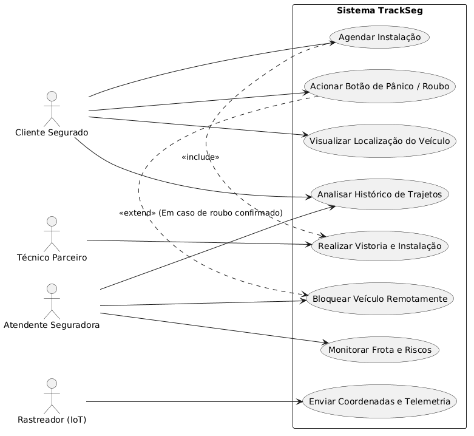
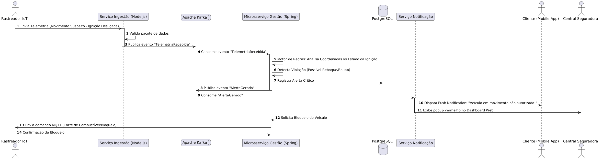
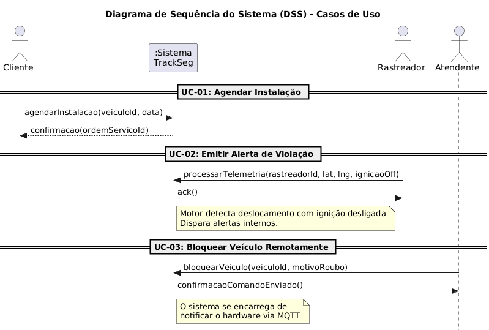
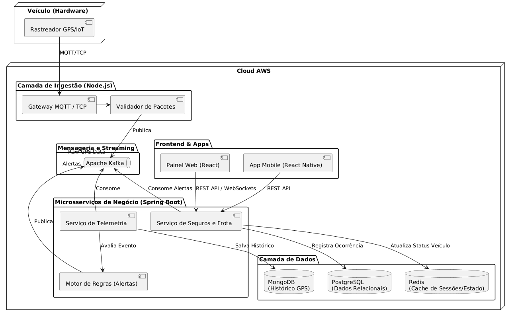
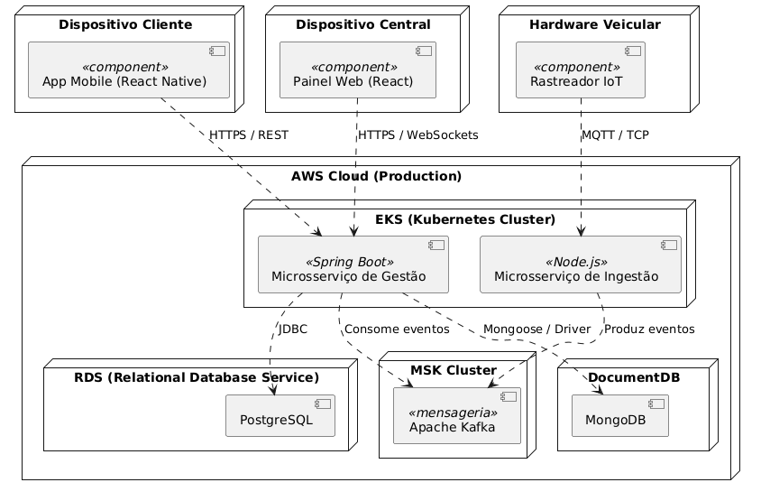
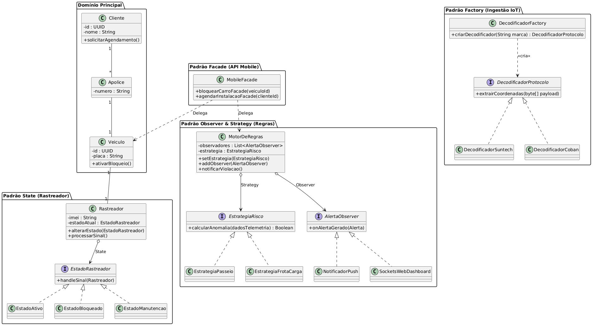
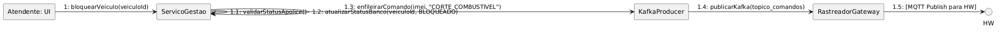
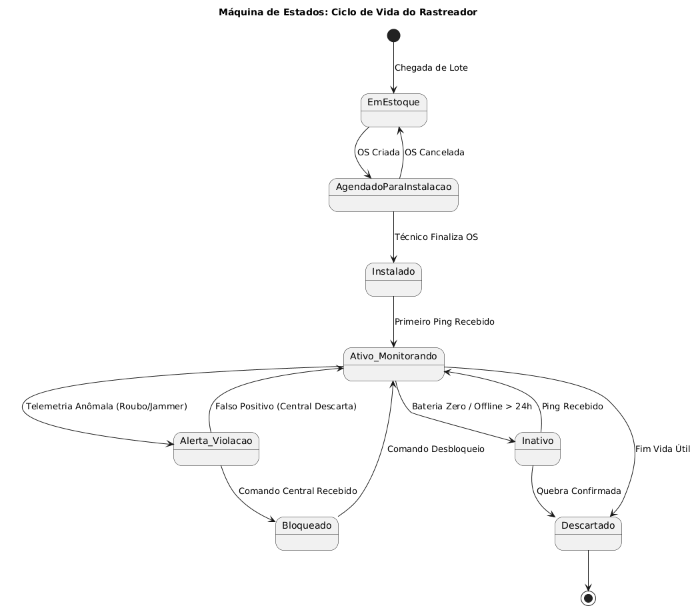
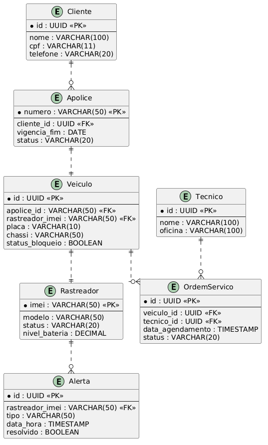

<!-- Este template foi criado para servir como referência e adaptado para o projeto final da disciplina -->

# 🛡️ TrackSeg - Gestão de Rastreadores Veiculares 📡

> [!NOTE]
> O **TrackSeg** é uma plataforma avançada desenvolvida para seguradoras, focada na gestão ponta a ponta da instalação, monitoramento e análise de dados de rastreadores veiculares via IoT.  

<table>
  <tr>
    <td width="800px">
      <div align="justify">
        Este projeto foi desenvolvido como requisito para o <b>Trabalho Final</b> da disciplina de Projeto de Software. O objetivo é apresentar a modelagem arquitetural e de design de uma aplicação complexa do mundo real. O <b>TrackSeg</b> moderniza o fluxo das seguradoras, oferecendo desde o agendamento da instalação do hardware pelo técnico parceiro, até o recebimento de telemetria em tempo real (via Apache Kafka), gerando alertas de movimentação suspeita, violação de cerca eletrônica ou acidentes. A plataforma engloba um painel web para a central de atendimento da seguradora, um aplicativo mobile para o cliente segurado e um módulo IoT para ingestão de dados.
      </div>
    </td>
  </tr> 
</table>

---

## 🚧 Status do Projeto

[](#)
[](#)
 
 


---

## 📚 Índice
- [Links Úteis](#-links-úteis)
- [Sobre o Projeto](#-sobre-o-projeto)
- [Funcionalidades Principais](#-funcionalidades-principais)
- [Tecnologias Utilizadas](#-tecnologias-utilizadas)
- [Arquitetura e Diagramas (PlantUML)](#-arquitetura-e-diagramas-plantuml)
- [Instalação e Execução](#-instalação-e-execução)
- [Estrutura de Pastas](#-estrutura-de-pastas)
- [Autores](#-autores)
- [Licença](#-licença)

---

## 🔗 Links Úteis
* 🌐 **Demo Online (Fictício):** [Acesse a Aplicação Web TrackSeg](https://trackseg-demo.com)
* 📖 **Documentação da API:** [Swagger UI](https://api.trackseg.com/swagger-ui.html)
* 📊 **Repositório de Diagramas:** [Ver pasta /diagramas](./diagramas)

---

## 📝 Sobre o Projeto
O **TrackSeg** nasceu da necessidade das grandes seguradoras modernizarem o controle sobre os rastreadores instalados nos veículos de seus clientes. Atualmente, o fluxo entre a contratação do seguro, a ida à oficina parceira para instalação e o início do envio de dados de GPS é falho e desconectado. 

**Qual problema ele resolve?**
- Unifica o agendamento de instalações entre clientes e oficinas mecânicas parceiras.
- Monitora em tempo real a saúde do rastreador (status de bateria, conectividade).
- Fornece um pipeline de processamento de eventos de alta vazão para dados de telemetria.
- Notifica a central e a polícia automaticamente em caso de detecção de roubo/furto.

**Onde ele pode ser utilizado?**
Por seguradoras de veículos, cooperativas de proteção veicular e empresas de gestão de frota.

---

## ✨ Funcionalidades Principais
- 📅 **Gestão de Instalações:** Workflow completo de agendamento, vistoria e validação do equipamento.
- 📡 **Telemetria em Tempo Real:** Ingestão de coordenadas GPS e dados de telemetria (velocidade, ignição).
- 🚨 **Motor de Regras e Alertas:** Detecção automática de jammer (bloqueador de sinal), bateria desconectada ou saída de perímetro seguro (Geofencing).
- 🔐 **Painel da Seguradora:** Dashboard analítico de risco da frota ativa.
- 📱 **App do Segurado:** Acesso à localização do veículo e botão de pânico.

---

## 🛠 Tecnologias Utilizadas

### 💻 Front-end
* **Framework:** React v18 com TypeScript
* **Estilização:** Tailwind CSS e Material UI
* **Gerenciamento de Estado:** Redux Toolkit
* **Mapas:** Google Maps API / Mapbox

### 🖥️ Back-end (Microsserviços)
* **API de Gestão (Seguros, Clientes, Agendamentos):** Java 17 com Spring Boot 3
* **API de Ingestão IoT (Alta vazão):** Node.js v20
* **Mensageria / Streaming:** Apache Kafka
* **Bancos de Dados:** PostgreSQL (Dados relacionais) e MongoDB (Histórico de posições GPS)
* **Cache:** Redis

### ⚙️ Infraestrutura & DevOps
* **Containerização:** Docker e Docker Compose
* **Cloud:** AWS (EKS, RDS, MSK)
* **Monitoramento:** Prometheus e Grafana

---

## 🧩 Padrões de Projeto (Design Patterns)

A engenharia do sistema foi pensada utilizando boas práticas e Padrões de Projeto (*GoF*), aplicados aos pontos de maior complexidade do domínio:

- **State:** Gerencia o ciclo de vida do Rastreador (Ativo, Bloqueado, Manutenção).
- **Observer:** Dispara múltiplos eventos em cadeia (Notificações, Sockets, Logs) quando uma violação de perímetro é detectada, reduzindo o acoplamento.
- **Factory Method:** Instancia decodificadores dinamicamente de acordo com a marca/fabricante do rastreador recebido na Ingestão IoT.
- **Strategy:** Alterna os algoritmos de cálculo de risco e precisão baseados no perfil do seguro contratado (Frota vs. Passeio).
- **Facade:** Simplifica o consumo da API pelo aplicativo móvel, consolidando processos distribuídos pesados sob endpoints limpos.

---

## 🏗 Arquitetura e Diagramas (PlantUML)

Optamos por uma **Arquitetura Baseada em Eventos (EDA - Event-Driven Architecture)** apoiada por microsserviços. Os dispositivos (rastreadores) enviam dados via protocolo MQTT ou TCP/IP para nosso serviço de Ingestão (Node.js), que publica essas coordenadas em tópicos do Apache Kafka. O Spring Boot consome esses tópicos, aplica as regras de negócio de seguro e persiste as informações, enquanto notifica os usuários via WebSockets e Push Notifications.

> Os diagramas fonte estão disponíveis na pasta `/diagramas`.

**📝 Relatório Completo:** Disponibilizamos também o [Relatório Final do Projeto](./relatorio_final.md) formatado para o documento oficial, contendo descrições aprofundadas, atores e contratos de operações.

### 1. Casos de Uso
Demonstra as interações dos principais atores (Cliente, Técnico, Sistema IoT e Atendente).

- [📄 Ver código PlantUML](./diagramas/casos_de_uso.puml)

### 2. Sequência (Alerta de Roubo)
Ilustra o fluxo passo a passo de notificação de violação e alerta do cliente.

- [📄 Ver código PlantUML](./diagramas/sequencia_alerta.puml)

### 3. Sequência do Sistema (DSS)
Contratos de operações e o fluxo de chamadas para o sistema em 3 Casos de Uso essenciais.

- [📄 Ver código PlantUML](./diagramas/ds_sistema.puml)

### 4. Arquitetura (Macro)
Visão técnica de como os microsserviços, banco de dados e mensageria se conectam no TrackSeg.

- [📄 Ver código PlantUML](./diagramas/arquitetura.puml)

### 5. Implantação e Componentes
Mapeamento da alocação dos serviços (Containers) em infraestrutura de nuvem (AWS).

- [📄 Ver código PlantUML](./diagramas/implantacao_componentes.puml)

### 6. Classes
Diagrama de domínio orientado a objetos contendo Veículo, Rastreador, Apólice, Cliente, etc.

- [📄 Ver código PlantUML](./diagramas/classes.puml)

### 7. Comunicação
Visão de colaboração focada nas invocações entre as camadas do sistema para Bloqueio Remoto.

- [📄 Ver código PlantUML](./diagramas/comunicacao.puml)

### 8. Máquina de Estados
Ciclo de vida do hardware Rastreador desde o estoque até a sua inutilização ou bloqueio.

- [📄 Ver código PlantUML](./diagramas/estados.puml)

### 9. Modelo de Dados (ER)
Diagrama Entidade-Relacionamento do banco de dados relacional (PostgreSQL).

- [📄 Ver código PlantUML](./diagramas/modelo_dados.puml)

---

## 🚀 Instalação e Execução

### Pré-requisitos
- Docker e Docker Compose instalados.
- Node.js v20 e Java 17.

### Como Executar Localmente
O projeto utiliza Docker Compose para subir toda a stack de microsserviços e bancos de dados simultaneamente.

```bash
# Clone o repositório
git clone https://github.com/seu-usuario/TrackSeg.git
cd TrackSeg

# Suba os serviços de infra (Postgres, Mongo, Kafka, Redis)
docker-compose -f infra/docker-compose.yml up -d

# Execute o Backend de Gestão (Spring Boot)
cd backend-gestao
./mvnw spring-boot:run

# Execute o Serviço de Ingestão (Node.js)
cd ../iot-ingestion
npm install
npm run start

# Execute o Frontend (React)
cd ../frontend
npm install
npm run dev
```

---

## 📁 Estrutura de Pastas

```text
/
├── diagramas/               # Códigos PlantUML dos diagramas do projeto
├── backend-gestao/          # Microsserviço Spring Boot (Gestão e Seguros)
├── iot-ingestion/           # Microsserviço Node.js (Ingestão de Rastreadores)
├── frontend/                # Aplicação Web React
├── mobile/                  # Aplicativo React Native para clientes
├── infra/                   # Scripts e Docker Compose para infraestrutura local
└── README.md                # Documentação do projeto
```

---

## 👨‍💻 Autores

- **Felipe Augusto Mendes Pereira** - Aluno Desenvolvedor - [@Felp_64](https://github.com/Felp_64)

**Professor Responsável:** 
- **João Paulo Aramuni** - [@joaopauloaramuni](https://github.com/joaopauloaramuni)

Trabalho Final desenvolvido para a disciplina de Projeto de Software.

## 📄 Licença
Este projeto está sob a licença MIT. Veja o arquivo `LICENSE` para mais detalhes.